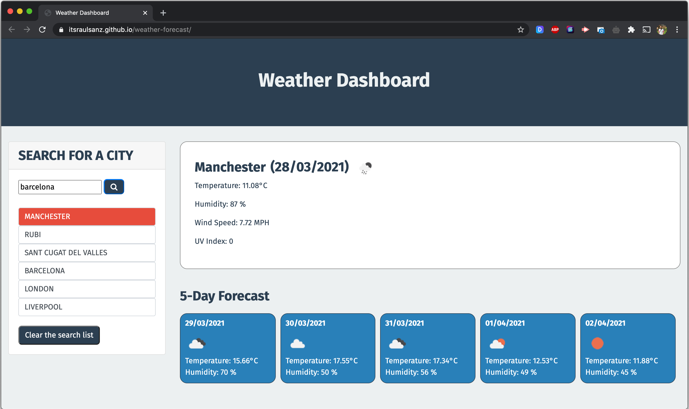

# Weather Dashboard

## Deployment

- Deployed App: [Heroku](https://itsraulsanz.github.io/weather-forecast/)

## Table of Contents

- [Description](#description)
- [Technologies Used](#technologies)
- [Contributing](#contributing)
- [Questions](#questions)
- [Screenshot](#screenshot)
- [Links](#links)
- [License](#license)

## Description

This repository contains a weather outlook for multiple cities that shows the current and the weather for the next 5 days.
It's built using [OpenWeather API] to retrieve weather data for cities.

## Technologies Used

- [OpenWeather API](https://openweathermap.org/api) Third-party API to retrieve weather data for cities 

- `localStorage` to store any persistent data.

## Contributing

To contribute further on this project please contacts the repo owners at the GitHub account below. 

## Questions

For any further questions, please contact GitHub user:
- [Raul Sanz](https://github.com/itsraulsanz)

Or for direct enquiries please email the follower address:
luarznas@gmail.com

## Screenshot

## Links

- Project Repository: [GitHub](https://github.com/itsraulsanz/weather-forecast)

- Issue tracker: [GitHub Issues](https://github.com/itsraulsanz/weather-forecast/issues)

## License

MIT

Copyright (c) [2021] [weather-forecast]

Permission is hereby granted, free of charge, to any person obtaining a copy
of this software and associated documentation files (the "Software"), to deal
in the Software without restriction, including without limitation the rights
to use, copy, modify, merge, publish, distribute, sublicense, and/or sell
copies of the Software, and to permit persons to whom the Software is
furnished to do so, subject to the following conditions:

The above copyright notice and this permission notice shall be included in all
copies or substantial portions of the Software.

THE SOFTWARE IS PROVIDED "AS IS", WITHOUT WARRANTY OF ANY KIND, EXPRESS OR
IMPLIED, INCLUDING BUT NOT LIMITED TO THE WARRANTIES OF MERCHANTABILITY,
FITNESS FOR A PARTICULAR PURPOSE AND NONINFRINGEMENT. IN NO EVENT SHALL THE
AUTHORS OR COPYRIGHT HOLDERS BE LIABLE FOR ANY CLAIM, DAMAGES OR OTHER
LIABILITY, WHETHER IN AN ACTION OF CONTRACT, TORT OR OTHERWISE, ARISING FROM,
OUT OF OR IN CONNECTION WITH THE SOFTWARE OR THE USE OR OTHER DEALINGS IN THE
SOFTWARE.
